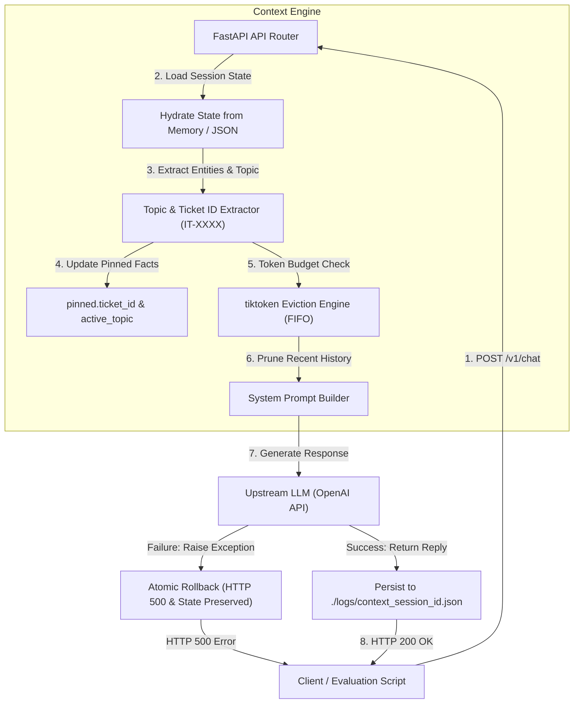
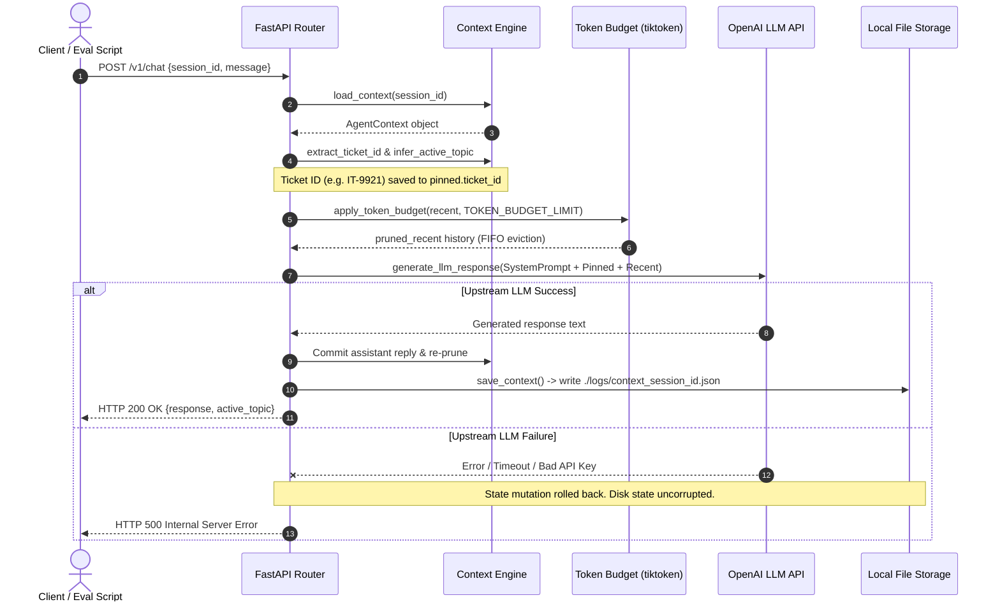

# Context-Aware IT Helpdesk Agent with Token Budgets & Pinned Memory

A production-grade conversational IT Helpdesk AI Agent API built with **FastAPI**, **tiktoken**, and **Docker**. The agent solves the "context amnesia" problem in long conversations through **explicit context engineering**:

1. **Pinned Memory (`pinned`)**: Permanent key-value facts (like Ticket IDs matching `IT-XXXX`) that bypass token eviction policies.
2. **Rolling Window (`recent`)**: Conversation message history managed via exact Byte-Pair Encoding (`cl100k_base` / `tiktoken`) with First-In-First-Out (FIFO) eviction when total tokens exceed `TOKEN_BUDGET_LIMIT`.
3. **Dynamic Topic Tracking (`active_topic`)**: Real-time semantic topic categorization (`general`, `ticket_inquiry`, `wifi_support`).
4. **State Observability & File Persistence**: Explicit JSON dumps to `./logs/context_{session_id}.json` after every turn.
5. **Atomic Transactional Error Handling**: Upstream LLM failures trigger HTTP 500 without corrupting or mutating conversation state on disk.

---

## 🏗️ Architecture & Pipeline

### System Workflow Diagram


### Request Sequence Diagram


---

## 📋 API Reference

### 1. `POST /v1/chat`
Conversational chat endpoint.

* **Request Body:**
  ```json
  {
    "session_id": "session_123",
    "message": "My ticket is IT-9921."
  }
  ```
* **Response (200 OK):**
  ```json
  {
    "response": "I have checked your ticket IT-9921...",
    "active_topic": "ticket_inquiry"
  }
  ```

### 2. `GET /v1/context/{session_id}`
Retrieves current context JSON for a session.

* **Response (200 OK):**
  ```json
  {
    "session_id": "session_123",
    "active_topic": "ticket_inquiry",
    "pinned": {
      "ticket_id": "IT-9921"
    },
    "recent": [
      { "role": "user", "content": "My ticket is IT-9921." },
      { "role": "assistant", "content": "I have checked your ticket IT-9921..." }
    ],
    "total_recent_tokens": 42
  }
  ```
* **Response (404 Not Found):** If `session_id` does not exist.

### 3. `GET /health`
Health check endpoint.

* **Response (200 OK):** `{"status": "ok"}`

---

## 🚀 One-Command Docker Setup

Start the service using Docker Compose:

```bash
docker-compose up -d
```

Verify health check:
```bash
curl http://localhost:8000/health
```

---

## 🧪 Running Automated Tests & 5-Turn Evaluation

### Run Unit & Integration Test Suite:
```bash
python -m pytest
```

### Run 5-Turn Context Engineering Script:
```bash
python eval_5_turns.py
```

The script verifies:
1. Turn 1 greeting (`active_topic` generic).
2. Turn 2 ticket ID entry (`IT-9921` -> `pinned.ticket_id`).
3. Turn 3 WiFi issue (forces token eviction of Turn 2 from `recent` rolling window).
4. Turn 4 WiFi troubleshooting steps.
5. Turn 5 ticket status query (proves agent remembers `IT-9921` via `pinned` memory despite eviction).

---

## ⚙️ Environment Variables

Copy `.env.example` to `.env`:

```env
TOKEN_BUDGET_LIMIT=4000
OPENAI_API_KEY=your_openai_api_key_here
OPENAI_MODEL=gpt-4o-mini
```
